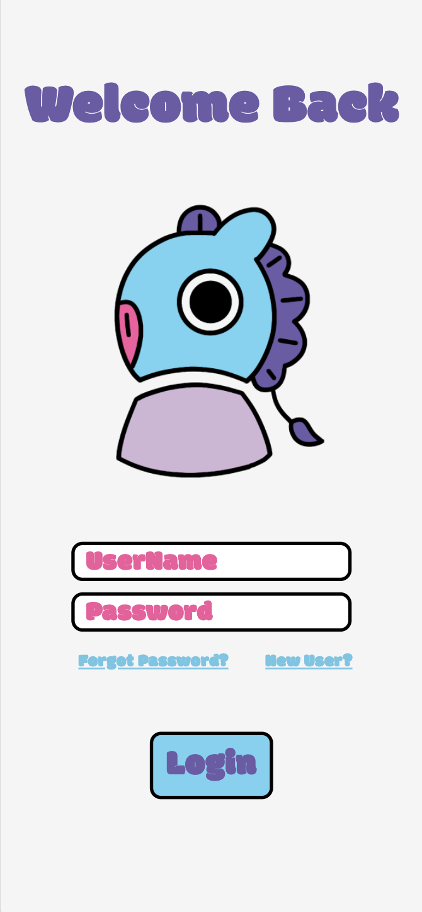
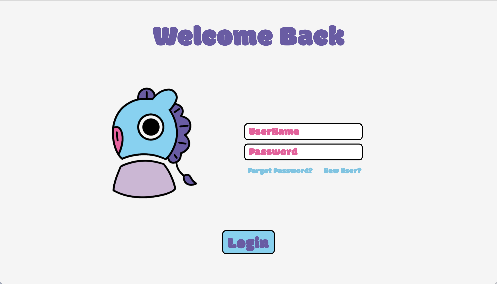

# BT21 Mang-Inspired Form Pages
This project showcases form pages inspired by BT21’s Mang character. The design is responsive, ensuring a seamless experience on both mobile and desktop devices, with a clean and playful layout. The Mang login icon, designed by Dev-Misa (me), adds a fun twist to a standard login icon! :)  
[Go to page🚀](https://dev-misa.github.io/mang-login-signup-page/)
### Who is Mang?
* BT21 is a set of characters created by the K-pop group BTS in collaboration with LINE FRIENDS. Each character represents a unique personality and style.
* Mang is one of these characters. It has a horse-like appearance and wears a mask. Mang is known for being energetic, fun, and loves to dance.

  <h1>Login Page</h1>
  
Mobile view

  
  
Desktop view

  

